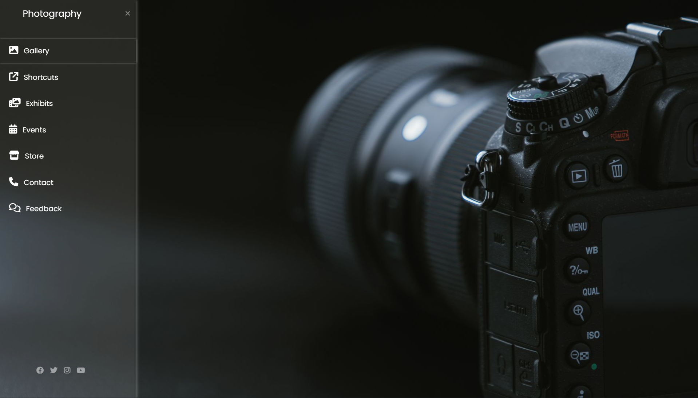

# Responsive Photography Website

A simple responsive photography landing page built using HTML and CSS.

## Features

- Responsive sidebar navigation
- Full-screen background image
- Clean and modern layout
- Responsive design

## Technologies Used

- HTML5
- CSS3

## Screenshot

## How to Run

1. Clone this repository.
2. Open `index.html` in your browser.

## Author

Dhruv
